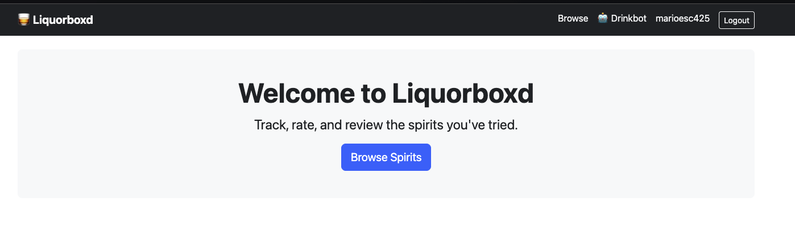
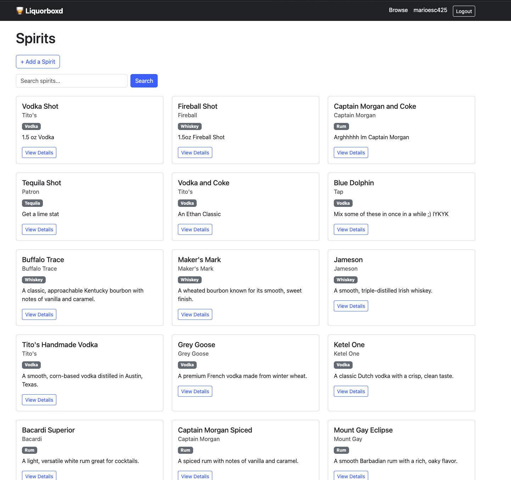
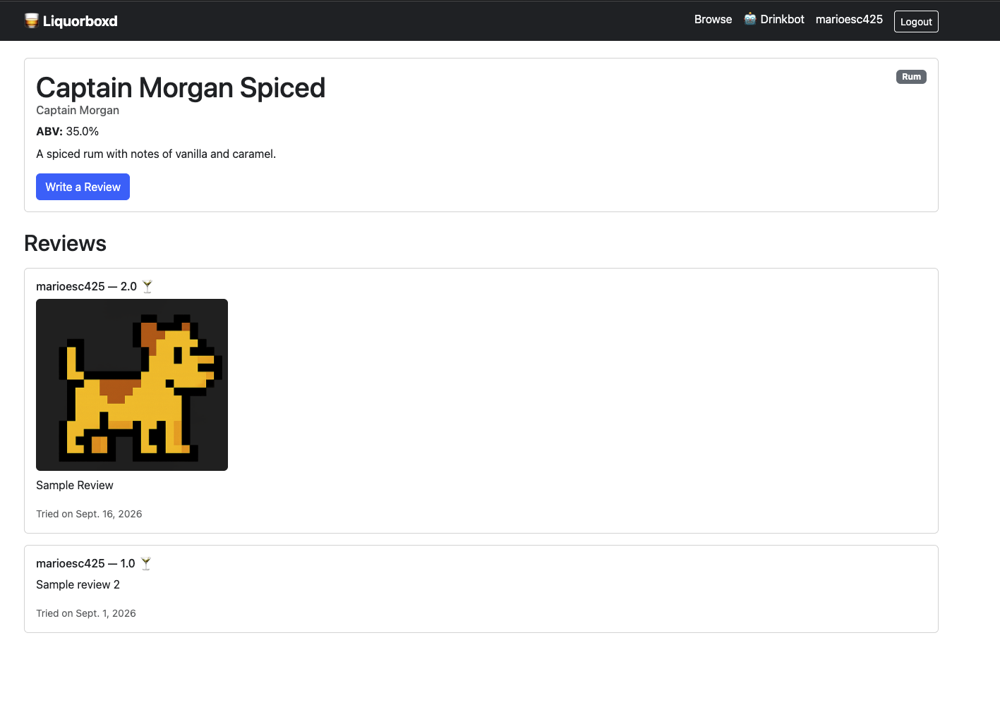
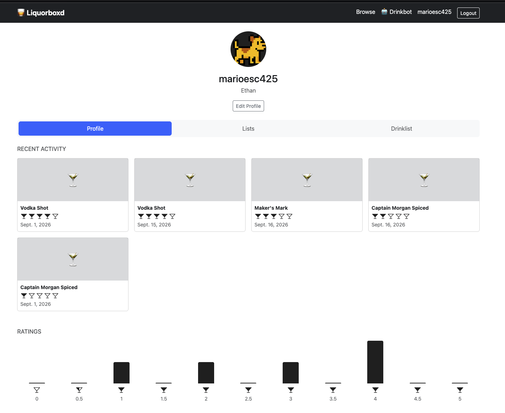

# Liquorboxd 🍸

Letterboxd, but for spirits. Track, rate, and review whiskey, vodka, rum, tequila, gin, and more — browse a community-built catalog, log your own tastings, and build out your profile.

Live site: [liquorboxd.onrender.com](https://liquorboxd.onrender.com)

This is a personal learning project built to strengthen full-stack development skills — from data modeling and backend logic to authentication, testing, deployment, and API design. All code was written by hand as a learning exercise, with AI used as a mentor for explanations and code review rather than as a code generator.

## Features

- **Accounts** — registration, login/logout, and a profile page with an editable bio and avatar
- **Spirit catalog** — browse and search spirits by name; any logged-in user can add a new spirit (name, category, brand, ABV, description, photo)
- **Reviews** — rate any spirit from 0–5 in half-point increments using a custom martini-glass rating widget (click to fill, click again for half, click again to clear), with optional written text, a photo, and a "date tried" that's independent of when the review was logged
- **Profile activity feed** — a Letterboxd-inspired profile layout showing your recent reviews as cards, plus a ratings distribution chart
- **REST API** — read-only JSON endpoints for spirits (list and detail), built with Django REST Framework
- **Database seeding** — a custom management command (`seed_spirits`) that populates the catalog with 15 real spirits across all five categories, safe to re-run without creating duplicates

## Tech Stack

- **Backend:** Python, Django
- **Database:** PostgreSQL, containerized locally with Docker; hosted on Render in production
- **Frontend:** Django templates, Bootstrap 5, vanilla JavaScript (for the martini rating widget and rating charts)
- **API:** Django REST Framework
- **Testing:** Django's test framework, run automatically via GitHub Actions CI on every push
- **Deployment:** Render, with Gunicorn and WhiteNoise for static files

## Screenshots

### Homepage


### Browsing Spirits


### Reviews


### Profile


## Local Development Setup

```bash
git clone https://github.com/marioesc425/Liquorboxd.git
cd Liquorboxd
python3 -m venv venv
source venv/bin/activate
pip install -r requirements.txt

cp .env.example .env
# then fill in .env with real values (SECRET_KEY, DB credentials, etc.)

docker compose up -d          # starts a local PostgreSQL container
python manage.py migrate
python manage.py seed_spirits # optional: populate with sample spirits
python manage.py runserver
```

## Running Tests

```bash
python manage.py test
```

Tests also run automatically on every push via GitHub Actions, against a real PostgreSQL instance.

## Project Structure

liquorboxd/
├── config/ # Django project settings, URLs
├── accounts/ # Auth, user profiles, avatars
├── spirits/ # Spirit catalog, reviews, REST API
├── core/ # Homepage and shared templates
├── .github/workflows/ # CI pipeline
├── docker-compose.yml # Local PostgreSQL container
├── build.sh # Render build/deploy script
└── requirements.txt


## What I Learned

Building this project involved real, hands-on work with:

- Django's ORM, model relationships (`ForeignKey`, `OneToOneField`), and signals
- Authentication, sessions, and permission-gated views
- Form handling, including file uploads and custom widget rendering
- Writing and running automated tests
- Environment-based configuration and secrets management
- Containerizing a database with Docker and migrating between database engines
- Debugging real production deployment issues — including environment variable mismatches between local and hosted environments, and the difference between a database's internal and external connection URLs
- Setting up CI with GitHub Actions, including running tests against a live service container
- Building a basic REST API layer with Django REST Framework

## Future Ideas

- Follows/followers and an activity feed
- Custom lists and a "want to try" list
- Personal stats and recommendations
- Distillery/brand pages
- Persistent cloud storage for uploaded images in production (currently uses local filesystem storage, which doesn't persist across Render redeploys on the free tier — AWS S3 or a similar service would be the fix)

## License

MIT